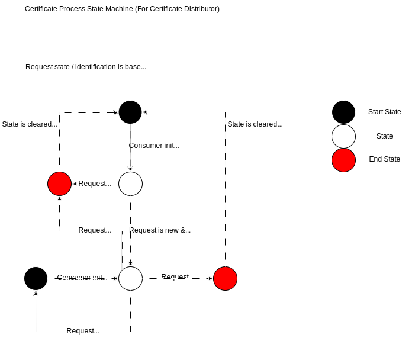

---
tags:
  - CAT/Value Added Services
---

# CX-0135 Business Partner Company Certificate Management v2.3.1

## ABSTRACT

In the world of business, company certificates are often mandatory for conducting transactions between two companies. However, the process of provisioning, maintaining, and validating these certificates can be a major challenge. For example, if a company has 100 customers, they may need to provide their company certificates in 100 different ways and maintain them at 100 different points.

To address this issue, a use case has been developed that provides a standardized but generic data model for company certificates. This standard allows Catena-X participants to provide, request, accept or reject company certificates using the Eclipse Data Space Connector (EDC).

## FOR WHOM IS THE STANDARD DESIGNED

This standard is relevant to the following parties:

- Certificate Consumer: Dataspace Participant who consumes certificates.
- Certificate Provider: Dataspace Participant who provides certificates.
- Business Application Provider

>**Context regarding the naming of involved parties:**
>The Catena-X operating model, as well as the EDC, uses the terms `Data Consumer` and `Data Provider`.
>The EDC uses these terms in regard to the parties that offer and consume EDC assets, while the operating model uses them in the context of information flow. 
>In some cases, these understandings align, but, for example, in the case of APIs (especially the certificate push mechanism), a mismatch can occur between the two. 
>To avoid misunderstandings, we use the terms `Certificate Consumer` and `Certificate Provider` to explicitly prevent this ambiguity.

## COMPARISON WITH THE PREVIOUS VERSION OF THE STANDARD

The updated standard introduces several enhancements over the previous version. One of the key changes is the definition of an OpenAPI. This will allow companies to proactively request certificates and provide feedback on their status. For the notification's requests, the Industry Core Standard ([CX-0151:1.0.0 Industry Core: Basics](https://catenax-ev.github.io/docs/standards/CX-0151-IndustryCoreBasics)) has been adopted.

Another important update involves a correction to the data model. The enclosedSiteBpn trait now accurately supports both BPNS and BPNA values, resolving a previous issue.
Resolved an issue in the usage policy.

These enhancements are designed to improve functionality and user experience, making the standard more reliable, efficient, and user-friendly.

## 1 INTRODUCTION

This standard is crucial for data providers and consumers who want to exchange company certificates through the Catena-X data space. By complying with this standard, companies can ensure seamless certificate management, thereby streamlining their overall operations.

The following company certificate use cases are supported in this release:

1. Certificate Provider wants to publish a certificate / Certificate Consumer wants to discover a published certificate.
2. Certificate Consumer wants to request a certificate from a specific Certificate Provider
3. Certificate Consumer wants to notify a Certificate Provider of acceptance or rejection of a consumed certificate via a status message
4. Certificate Provider wants to notify a Certificate Consumer of the availability of a new certificate asset

For avoidance of the doubt, we are not replacing the existing publication semantic model.

### 1.1 AUDIENCE & SCOPE

> *This section is non-normative*

List for which roles the standard is relevant:

- Certificate Provider and Consumer
- Business Application Provider
- Enablement Service Provider

This standard applies to business application providers and enablement service providers who aim to offer a solution for managing and exchanging company certificates, and returning them to customers.
It is also important for Certificate Providers and Consumers who need to manage and exchange certificates through a solution provider.

### 1.2 CONTEXT AND ARCHITECTURE FIT

> *This section is non-normative*

The establishment of various industry networks, such as Catena-X, has significantly increased the need for data standards across the entire automotive value chain. To promote industry-wide, international data exchange and facilitate networking between OEMs, suppliers, customers, and industrial partners, it is essential to define and introduce a cross-industry standard for the provisioning, exchanging and maintenance, of company certificates. This standard ensures interoperability and data sovereignty, while also increasing trust in certificates.

By implementing this standard, companies can streamline the process of managing and exchanging certificates, reducing the burden of maintaining multiple certificates for different customers. Additionally, the standard ensures that certificates are exchanged in a secure and reliable manner, enhancing trust and confidence in the data exchange process. Overall, the introduction of a cross-industry standard for company certificates is a crucial step towards achieving seamless and secure data exchange across the automotive industry.

This aspect model is written in SAMM 2.1.0 as a modeling language conformant to [CX-0003:1.1 SAMM Semantic Aspect Meta Model](../CX-0003-SAMMSemanticAspectMetaModel/CX-0003-SAMMSemanticAspectMetaModel.md).

SAMM is used to create data models, which are attached to e.g. digital twins in the form of an Asset Administration Shell (AAS) submodel or exchanged as JSON-File.

All submodels in Catena-X are managed in the [Tractus-X GitHub repository](https://github.com/eclipse-tractusx/sldt-semantic-models/). A data model is requested and exchanged via Catena-X using an Dataspace Connector ([CX-0018 Dataspace Connectivity](https://catenax-ev.github.io/docs/standards/CX-0018-DataspaceConnectivity)), which is a separate Catena-X standard.

### 1.3 CONFORMANCE AND PROOF OF CONFORMITY

> *This section is non-normative*

As well as sections marked as non-normative, all authoring guidelines, diagrams, examples, and notes in this specification are non-normative. Everything else in this specification is normative.

The key words MAY, MUST, MUST NOT, OPTIONAL, RECOMMENDED, REQUIRED, SHOULD and SHOULD NOT in this document are to be interpreted as described in [BCP 14](https://datatracker.ietf.org/doc/html/bcp14) [[RFC2119](https://www.w3.org/TR/did-core/#bib-rfc2119 "Key words for use in RFCs to Indicate Requirement Levels")] [[RFC8174](https://www.w3.org/TR/did-core/#bib-rfc8174 "Ambiguity of Uppercase vs Lowercase in RFC 2119 Key Words")] when, and only when, they appear in all capitals, as shown here.

All participants and their solutions will need to proof, that they are conform with the Catena-X standards. To validate that the standards are applied correctly, Catena-X employs Conformity Assessment Bodies (CABs).

See [API Message Flow](#215-message-flow-expectations) expectations for conformance requirements.

## 2 APPLICATION PROGRAMMING INTERFACES

> *This section and all its subsections are normative*

Today, Certificate Consumer do not have a way to request certificates from a Certificate Provider. Also, Data Certificate Provider have no visibility on the status of a published certificate beyond the technical delivery. Finally, Certificate Provider do not have a standard mechanism to send new certificates to the Certificate Consumer when they become available.

Use cases to provide certificates (from who initiates communication, negotiation and data transfer):

- Certificate Consumer -> Certificate Provider: Company Certificate Pull
- Certificate Provider -> Certificate Consumer: Company Certificate Push

Use case to give feedback on the status for consumed certificates:

- Certificate Consumer -> Certificate Provider: Company Certificate Status (Received, Accepted, or Rejected)

Use case to notify about availability of certificates:

- Certificate Provider -> Certificate Consumer: Company Certificate Available

### 2.1 API Specification

This section introduces the certificate management notification API which is further detailed in the corresponding [OpenAPI specification](assets/openapi-spec.yaml).

#### 2.1.1 API endpoints and resources

##### 2.1.1.1 Company Certificate Request

The Certificate Consumer is requesting a specific certificate from the Certificate Provider.
This request can be sent by the Certificate Consumer continuously, for updates on the request state on Certificate Provider side.



`POST /companycertificate/request`

```json
{
  "header": {
    "senderBpn": "BPNL0000000001AB",
    "context": "CompanyCertificateManagement-CCMAPI-Request:1.0.0",
    "messageId": "e94eaa84-6fb3-4693-a189-201a20dfcecf",
    "receiverBpn": "BPNL0000000002CD",
    "sentDateTime": "2025-05-04T00:00:00-07:00",
    "version": "3.1.0"
  },
  "content": {
    "certifiedBpn": "BPNL00000003AYRE",
    "certificateType": "iso9001",
    "locationBpns": [
      "BPNA000000000001",
      "BPNA000000000002",
      "BPNS000000000003"
    ]
  }
}
```

##### 2.1.1.1.1 HTTP Response Codes

| HTTP Code | Description                                                               |
|-----------|---------------------------------------------------------------------------|
| 200       | OK. Certificate request processing completed (detailed response in body). |
| 202       | Certificate request accepted and in processing.                           |
| 400       | Request malformed.                                                        |
| 500       | Internal Server Error.                                                    |

>**EDC Behavior**:
>At the moment (standard release 25.09), the open-source EDC will always proxy a `500` internal server error when it encounters a `4xx` or `5xx` HTTP response code from the API. 
>This means that in the case of a malformed request, while the API should return a `400` status code, the final EDC response that the consumer receives will be `500`. 
>Until a future EDC update changes this behavior to proxy all status codes without changes, applications will need to be able to deal with this technical reality.

The detailed response bodies for HTTP Code 200 are described in 2.1.1.1.2 and following.
HTTP Status Codes 202, 400 and 500 do not come with a response body.

##### 2.1.1.1.2 HTTP Response Body for HTTP Code 200, Status: IN PROGRESS

Case: Certificate Request Still In Process

```json
{
  "header": {
    "senderBpn": "BPNL0000000001AB",
    "context": "CompanyCertificateManagement-CCMAPI-Request:1.0.0",
    "messageId": "b53a4682-6cb5-48f3-b3fa-0bf20718dc52",
    "receiverBpn": "BPNL0000000002CD",
    "sentDateTime": "2025-05-04T00:00:00-07:00",
    "version": "3.1.0"
  },
  "content": {
    "requestStatus": "IN_PROGRESS"
  }
}
```

##### 2.1.1.1.3 HTTP Response Body for HTTP Code 200, Status: COMPLETED

Finished Processing and Certificate available in EDC.
The content body also provides the documentId of the certificate.
This simplifies finding the correct offer for the requested certificate.

```json
{
  "header": {
    "senderBpn": "BPNL0000000001AB",
    "context": "CompanyCertificateManagement-CCMAPI-Request:1.0.0",
    "messageId": "07a71867-f05e-4b6a-9944-2531b854c40a",
    "receiverBpn": "BPNL0000000002CD",
    "sentDateTime": "2025-05-04T00:00:00-07:00",
    "version": "3.1.0"
  },
  "content": {
    "documentId": "00000000-0000-0000-0000-000000000001",
    "requestStatus": "COMPLETED"
  }
}
```

>**`documentId` explanation**:
> The reasoning why a documentId (the unique ID of EDC asset of the certificate) is to be returned (and not for example the certificate as a return payload) is,
> so that the Certificate Provider can specify (for each certificate) a dedicated contract offer, and thus use different usage policies for the certificates and API(s).
> That way the Certificate Provider has all options available in terms of data sovereignty and full access control on an EDC (contract based) level.

##### 2.1.1.1.4 HTTP Response Body for HTTP Code 200, Status: REJECTED

Finished Processing and Certificate Request Rejected.
The request errors and location errors SHOULD contain all encountered problems in detail.
The error message is free text.

```json
{
  "header": {
    "senderBpn": "BPNL0000000001AB",
    "context": "CompanyCertificateManagement-CCMAPI-Request:1.0.0",
    "messageId": "0ee9c20f-a55e-43c9-9a3f-0cb23d4f134d",
    "receiverBpn": "BPNL0000000002CD",
    "sentDateTime": "2025-05-04T00:00:00-07:00",
    "version": "3.1.0"
  },
  "content": {
    "requestStatus": "REJECTED",
    "requestErrors": [
      {
        "message": "We do not process certificates on Sunday"
      },
      {
        "message": "Can not provide certicate for requested locations"
      }
    ],
    "locationErrors": [
      {
        "bpn": "BPNS000000000003",
        "locationErrors": [
          {
            "message": "Site BPNS000000000003 is unknown"
          }
        ]
      }
    ]
  }
}
```

##### 2.1.1.2 Company Certificate Push

Certificate is pushed by the Certificate Provider to the Certificate Consumer.
The enclosed BPNs can be a mix of sites and addresses.
The Certificate Consumer may want to send a subsequent status message.

`POST /companycertificate/push`

```json
{
  "header": {
    "senderBpn": "BPNL0000000001AB",
    "senderFeedbackUrl": "https://domain.tld/path/to/edc/api/v1/dsp",
    "context": "CompanyCertificateManagement-CCMAPI-Push:1.0.0",
    "messageId": "8bf22334-97f2-42b4-afca-f68160707b83 ",
    "receiverBpn": "BPNL0000000002CD",
    "sentDateTime": "2025-05-04T00:00:00-07:00",
    "version": "3.1.0"
  },
  "content": {
    "businessPartnerNumber": "BPNL0000000001AB",
    "enclosedSites": [
      {
        "areaOfApplication": "Development, Marketing und Sales and also Procurement for interior components",
        "enclosedSiteBpn": "BPNS00000003AYRE"
      }
    ],
    "registrationNumber": "12 198 54182 TMS",
    "uploader": "BPNL0000000001AB",
    "document": {
      "documentID": "UUID--123456789",
      "creationDate": "2024-08-23T13:19:00.280+02:00",
      "contentType": "application/pdf",
      "contentBase64": "iVBORw0KGgoAAdsfwerTETEfdgd"
    },
    "validator": {
      "validatorName": "Data service provider X",
      "validatorBpn": "BPNL00000007YREZ"
    },
    "validUntil": "2026-01-24",
    "validFrom": "2023-01-25",
    "trustLevel": "none",
    "type": {
      "certificateVersion": "2015",
      "certificateType": "iso9001"
    },
    "areaOfApplication": "Development, Marketing und Sales and also Procurement for interior components",
    "issuer": {
      "issuerName": "TÜV",
      "issuerBpn": "BPNL133631123120"
    }
  }
}

```
The ´senderFeedbackUrl´ specifies, where the Certificate Provider expects feedback on the status from the Certificate Consumer.
The expected value **MUST** be a concrete path to the version 1 dataspace protocol endpoint,
where a data offer for an asset of type cx-taxo:CCMAPI **MUST** be available for the Certificate Consumer.

>**Push header `senderFeedbackUrl` explanation**:
>This information is intended as a temporary solution to support the unique identification of multiple status endpoints across multiple EDCs belonging to one legal entity.
>The typical way to implement such differentiation in the Catena-X data space would be to provide additional, distinguishing attributes to the EDC assets to enable an automated search mechanism via the EDC discovery service and EDC catalogs. 
>Since the current changes are implemented as a non-breaking standard patch, the senderFeedbackUrl remains an intermediate solution. 
>A future change is required in that regard, especially when considering the deprecation of the v1 DSP endpoint in favor of an upcoming EDC `.well-known` endpoint that supports multiple DSP versions.

>**`documentID` spelling**:
> Please mind that in contrast to other requests the field `documentID` in the push notification request is spelled with a capital `D` due to the spelling in the [aspect model](#31-aspect-model-businesspartnercertificate).

##### 2.1.1.3 Company Certificate Status

`POST /companycertificate/status`

This API is used by the Certificate Consumer to give feedback on the status to the Certificate Provider, thus either accepting or rejecting the provided certificate.
This is regardless of whether the certificate was [pulled](#2152-pull-mechanism) or [pushed](#2151-push-mechanism).

##### 2.1.1.3.1 Company Certificate Status: Received

Certificate has been received by Certificate Consumer and validation is in progress.

```json
{
  "header": {
    "senderBpn": "BPNL0000000001AB",
    "context": "CompanyCertificateManagement-CCMAPI-Status:1.0.0",
    "messageId": "f2cd0df7-5cdb-4a09-b273-c7cfbceccf2d",
    "receiverBpn": "BPNL0000000002CD",
    "sentDateTime": "2025-05-04T00:00:00-07:00",
    "version": "3.1.0"
  },
  "content": {
    "documentId": "00000000-0000-0000-0000-000000000002",
    "certificateStatus": "RECEIVED",
    "locationBpns": [
      "BPNS000000000001",
      "BPNS000000000002",
      "BPNS000000000003",
      "BPNA000000000001",
      "BPNA000000000002",
      "BPNA000000000003"
    ]
  }
}
```

##### 2.1.1.3.2 Company Certificate Status: Accepted

Certificate is accepted. 
The documentId **MUST** match the documentId that was communicated by the certificate provider.
The `locationBpns` can be a mix of sites and addresses.

```json
{
  "header": {
    "senderBpn": "BPNL0000000001AB",
    "context": "CompanyCertificateManagement-CCMAPI-Status:1.0.0",
    "messageId": "a6dca795-a1ae-4e8d-9e41-b82ebe9ebd5b",
    "receiverBpn": "BPNL0000000002CD",
    "sentDateTime": "2025-05-04T00:00:00-07:00",
    "version": "3.1.0"
  },
  "content": {
    "documentId": "00000000-0000-0000-0000-000000000001",
    "certificateStatus": "ACCEPTED",
    "locationBpns": [
      "BPNS000000000001",
      "BPNS000000000002",
      "BPNS000000000003",
      "BPNA000000000001",
      "BPNA000000000002",
      "BPNA000000000003"
    ]
  }
}
```

##### 2.1.1.3.3 Company Certificate Status: Rejected

Certificate is rejected by the Certificate Consumer with one or multiple reasons.

```json
{
  "header": {
    "senderBpn": "BPNL0000000001AB",
    "context": "CompanyCertificateManagement-CCMAPI-Status:1.0.0",
    "messageId": "f67b9853-b714-4427-a8f3-4c53a9822da0",
    "receiverBpn": "BPNL0000000002CD",
    "sentDateTime": "2025-05-04T00:00:00-07:00",
    "version": "3.1.0"
  },
  "content": {
    "documentId": "00000000-0000-0000-0000-000000000003",
    "certificateStatus": "REJECTED",
    "certificateErrors": [
      {
        "message": "We do not process certificates on Sunday"
      },
      {
        "message": "Certificate has expired in 2024"
      },
      {
        "message": "Certificate was revoked"
      },
      {
        "message": "Unexpected data format"
      },
      {
        "message": "Unexpected language expected English, received Mandarin"
      },
      {
        "message": "Expected PDF, received JPG"
      },
      {
        "message": "Unknown BPNL000000000000"
      }
    ],
    "locationBpns": [
      "BPNS000000000001",
      "BPNS000000000002",
      "BPNS000000000003",
      "BPNA000000000001",
      "BPNA000000000002",
      "BPNA000000000003"
    ],
    "locationErrors": [
      {
        "bpn": "BPNS000000000002",
        "locationErrors": [
          {
            "message": "Site BPNS000000000002 has been Rejected"
          }
        ]
      },
      {
        "bpn": "BPNS000000000003",
        "locationErrors": [
          {
            "message": "Site BPNS000000000003 is missing"
          }
        ]
      }
    ]
  }
}
```

##### 2.1.1.4 Company Certificate Available

The Certificate Consumer is notified that a certificate is available.
The Certificate Consumer may want to consume the certificate via the pull mechanism.

```json
{
  "header": {
    "senderBpn": "BPNL0000000001AB",
    "context": "CompanyCertificateManagement-CCMAPI-Available:1.0.0",
    "messageId": "3b4edc05-e214-47a1-b0c2-1d831cdd9ba9",
    "receiverBpn": "BPNL0000000002CD",
    "sentDateTime": "2025-05-04T00:00:00-07:00",
    "version": "3.1.0"
  },
  "content": {
    "documentId": "00000000-0000-0000-0000-000000000001",
    "certificateType": "iso9001",
    "locationBpns": [
      "BPNS000000000001",
      "BPNS000000000002",
      "BPNS000000000003",
      "BPNA000000000001",
      "BPNA000000000002",
      "BPNA000000000003"
    ]
  }
}
```

#### 2.1.2 ERROR HANDLING

The following http response codes **MUST** be defined for all resources:

| Status Code | Description                |
|-------------|----------------------------|
| 200         | OK                         |
| 500         | Internal Server Error      |

#### 2.1.3 Available data types

The API **MUST** use JSON formatted data transmitted over HTTPS.

#### 2.1.4 Data asset structure

The following sections detail how notification API and certificate assets should be offered in the dataspace.
Please note the depicted examples show `@id` fields with random example UUIDs.
Every dataspace participant may use their individual random uuid.

##### 2.1.4.1 Notification API

> *This section is normative*

The HTTP endpoints introduced in chapter [2.1.1 API endpoints and resources](#211-API-endpoints-and-resources) **MUST NOT** be called from a business partner directly. 
Rather, it **MUST** be called with any CX-0018 compliant connector via dataspace protocol.
Therefore, the Certificate Provider **MUST** offer an asset to expose an API for Certificate Consumer in the connector catalog.
In turn, the Certificate Consumer **MAY** offer an asset to expose an API for the Certificate Provider in the connector catalog to push certificates to.

The property [[type]](http://purl.org/dc/terms/type) **MUST** reference the name of the certificate management API as defined in the Catena-X taxonomy published under [[taxonomy]](https://w3id.org/catenax/taxonomy).

| **Type**       | **Subject**                                         | **Version** | **Description** |
|----------------|-----------------------------------------------------|-------------|-----------------|
| cx-taxo:CCMAPI | cx-taxo:CompanyCertificateManagementNotificationApi | 3.0         | Offers *Certificate Notification API* for [requesting](#2111-company-certificate-request) and [pushing](#2112-company-certificate-push) certificates as well as sending feedback on the [status](#2113-company-certificate-status) for provided certificates and receiving [availability](#2114-company-certificate-available) notifications. |

There **MUST** only be one unique asset per API (subject and version) across all connectors of one BPNL.

*Example*: it is possible to have these assets available next to one-another:
- ```{ "dct:subject": { "@id": "cx-taxo:CompanyCertificateManagementNotificationApi" }, "cx-common:version": "3.0" }```, 
- ```{ "dct:subject": { "@id": "cx-taxo:CompanyCertificateManagementNotificationApi" }, "cx-common:version": "2.0" }```

since they either differ in the value of the version or the subject. 
But it would not be possible to have two of the same subject and the same version.

*Example that is not allowed:*
- ```{"dct:subject": { "@id": "cx-taxo:CompanyCertificateManagementNotificationApi" }, "cx-common:version": "3.0" }```,
- ```{"dct:subject": { "@id": "cx-taxo:CompanyCertificateManagementNotificationApi" }, "cx-common:version": "3.0" }```

It doesn't matter if the assets are offered in one or in different connectors, as long as they belong to the same BPNL this is not allowed.

**Example Certificate Notification API**
```json
{
  "@id": "81a0bdf8-732f-488e-bddb-1b9a78f0d1e0",
  "@type": "Asset",
  "properties": {
    "dct:type": {
      "@id": "cx-taxo:CCMAPI"
    },
    "dct:subject": {
      "@id": "cx-taxo:CompanyCertificateManagementNotificationApi"
    },
    "dct:description": "Offers Certificate Notification API for requesting and pushing certificates as well as sending feedback on the status for provided certificates and receiving availability notifications.",
    "cx-common:version": "3.0"
  },
  "dataAddress": {},
  "@context": {
    "dct": "http://purl.org/dc/terms/",
    "cx-taxo": "https://w3id.org/catenax/taxonomy#",
    "cx-common": "https://w3id.org/catenax/ontology/common#"
  }
}
```

> The **API assets** are identified by the combination of `dct:subject` and `cx-common:version`.
> When searching the EDC catalog for a specific API, make use of those properties in the catalog filter.

##### 2.1.4.2 Certificates

- The certificate assets **MUST** be created by the Certificate Provider in their connector catalog to be consumed by the Certificate Consumer when using the pull mechanism.
- The property certificateType **MUST** reference the type of the certificate as defined in [3.2.2 Certificate Type](#322-certificate-type).
- The property enclosedSites **MUST** contain all BPNSs and BPNAs for which the certificate is valid.
- The subject **MUST** reference `cx-taxo:CompanyCertificate`.
- Additionally, the assets **MUST** contain the type `cx-taxo:Submodel` and the semanticId specified in [3.1.2 Business Partner Company Certificate Submodel](#312-business-partner-company-certificate-submodel).

**Example Certificate EDC Asset:**

```json
{
  "@id": "d195fa2f-e6bc-4cd6-94d4-2bb76e4bb548",
  "@type": "Asset",
  "properties": {
    "dct:type": {
      "@id": "cx-taxo:Submodel"
    },
    "aas:semanticId": {
      "@id": "urn:samm:io.catenax.business_partner_certificate:3.1.0#BusinessPartnerCertificate"
    },
    "dct:certificateType": {
      "@id": "cx-taxo:iso9001"
    },
    "dct:enclosedSites": [
      {
        "@id": "cx-taxo:BPNS000000000001"
      },
      {
        "@id": "cx-taxo:BPNS000000000002"
      },
      {
        "@id": "cx-taxo:BPNA000000000001"
      }
    ],
    "dct:subject": {
      "@id": "cx-taxo:CompanyCertificate"
    },
    "dct:description": "Business Partner Company Certificate",
    "cx-common:version": "3.0"
  },
  "dataAddress": {
    "@type": "DataAddress",
    "type": "HttpData",
    "baseUrl": "https://backend-base-url/certificate-management-api-base-path",
    "proxyQueryParams": "false",
    "proxyPath": "false",
    "proxyMethod": "false",
    "proxyBody": "false"
  },
  "@context": {
    "dct": "http://purl.org/dc/terms/",
    "cx-taxo": "https://w3id.org/catenax/taxonomy#",
    "cx-common": "https://w3id.org/catenax/ontology/common#"
  }
}
```

> The **certificate assets** are identified by the combination of `dct:subject`, `dct:certificateType` and `dct:enclosedSites`.
> When searching the EDC catalog for a specific asset for which the assetId is unkown, make use of those properties in the catalog filter.

#### 2.1.5 MESSAGE FLOW EXPECTATIONS

Certificate Provider & Certificate Consumer:
- Certificate Provider **MUST** support at least one of the certificate provision mechanisms (push and/or pull mechanism)
- Certificate Provider **MUST** expose company certificates in their catalog when using the pull mechanism.
- Certificate Provider **MUST** set the correct access and usage policy on the certificate offer to allow consumption by Consumer(s) when using the pull mechanism.

- Certificate Consumer **MAY** implement the [push endpoint](#2112-company-certificate-push) for the Certificate Provider to push certificates to, but **MUST** set the correct access and usage policy on the offer, when choosing to do so.
- Certificate Consumer **MAY** send a certificate request via `POST /companycertificate/request` which **MUST** be replied to by the Certificate Provider according to the endpoint definitions.
- Certificate Consumer **MAY** send a notification of reception when the certificate validation has started via `POST /companycertificate/status`.
- Certificate Consumer **MAY** send a notification of acceptance or rejection via `POST /companycertificate/status`.
  Certificate Provider **MUST** respond according to the [error handling](#212-error-handling).

- Certificate Provider **MAY** send a notification of availability via `POST /companycertificate/available` after the referenced company certificate is exposed in their catalog.
  Certificate Consumer **MUST** respond according to the [error handling](#212-error-handling) and **SHOULD** get the new certificate via the pull mechanism.
- Certificate Consumer **MAY** implement the [available endpoint](#2113-company-certificate-available) for the Certificate Provider to send availability notifications to, but **MUST** set the correct access and usage policy on the offer, when choosing to do so.

Business Application Provider:
- Business Application Provider **MUST** implement all features of the Certificate Notification API, including the support of the push, the pull and also the status and available mechanism.
- Business Application Provider **MUST** offer the push mechanism option to the Certificate Consumer application user, if the Certificate Consumer supports the push mechanism.

##### 2.1.5.1 PUSH Mechanism


The Certificate PUSH Diagram describes the secure transmission of certificates from a Backend Certificate Provider to a Backend Certificate Consumer via EDC (Eclipse Data Connector) components.
The process starts with a contract agreement for a Notification Asset, followed by the provider pushing the certificate to the provided endpoint in the asset.  
The certificate is then processed by the Backend Certificate Consumer, which finalizes the workflow by generating a status message which is pushed to the provider.

##### 2.1.5.2 PULL Mechanism


The Certificate PULL Diagram describes the process of Consumer retrieving a certificate from a Provider via an EDC.
It begins with the provider creating a Certificate Asset with corresponding contract definition in the EDC Catalog. 
The Consumer searches the catalog using specific filters, initiates a contract negotiation, and retrieves the Endpoint Data Reference (EDR). 
The Data Plane then facilitates secure data transfer, allowing the consumer to pull the certificate. 
Once retrieved, the Backend Certificate Consumer processes the certificate and sends a status message to confirm the status.

##### 2.1.5.3 AVAILABLE notification followed by PULL mechanism

After the Certificate Provider has created a Certificate Asset with the corresponding contract definition in the EDC Catalog, the Certificate Provider sends a Certificate Available Notification to the Certificate Consumer.
The Certificate Consumer uses the above described PULL mechanism to get the certificate data.
This reduces the Certificate Consumers need for active checks for missing certificates or certificate updates and enables access to the latest certificate data.

##### 2.1.6 Usage Policy

All offers included in the EDC of a dataspace participant (APIs and Certificates) **MUST** contain a usage policy that includes the Catena-X Data Exchange Governance document in version 1.0.
The use-case introduces the following usage purpose:

- **`cx.ccm.base:1:`** *The exchanged business partner certificates are used for the purpose of verification and validation of the existence of a certification.*

Additional more general usage policies **MAY** be included, 
but all the usage policies **MUST** contain the above usage purpose.

*Minimal example of a usage policy without contract reference:*
``` json
{
  "@context": [
    "http://www.w3.org/ns/odrl.jsonld",
    {
      "@vocab": "https://w3id.org/edc/v0.0.1/ns/",
      "cx-policy": "https://w3id.org/catenax/policy/"
    }
  ],
  "@type": "PolicyDefinition",
  "@id": "CCMAPI-usage-policy-without-contract-reference",
  "profile": "cx-policy:profile2405",
  "policy": {
    "@type": "Set",
    "permission": [
      {
        "action": "use",
        "constraint": {
          "and": [
            {
              "leftOperand": "cx-policy:FrameworkAgreement",
              "operator": "eq",
              "rightOperand": "DataExchangeGovernance:1.0"
            },
            {
              "leftOperand": "cx-policy:UsagePurpose",
              "operator": "eq",
              "rightOperand": "cx.ccm.base:1"
            }
          ]
        }
      }
    ]
  }
}
```

The constraint `{ "leftOperand": "cx-policy:ContractReference" }` **MUST** be included only if such a bilateral framework contract exists.

```json
{
  "leftOperand": "cx-policy:ContractReference",
  "operator": "eq",
  "rightOperand": "x12345"
}
```

## 3 ASPECT MODELS

### 3.1 ASPECT MODEL "BusinessPartnerCertificate"

> *This section is normative*

This aspect model is written in SAMM 2.1.0 as a modeling language conformant to [CX-0003:1.1](https://catenax-ev.github.io/docs/standards/CX-0003-SAMMSemanticAspectMetaModel) as input for the semantic driven workflow.

Like all Catena-X data models, this model is available in a machine-readable format on GitHub conformant to [CX-0003:1.1](https://catenax-ev.github.io/docs/standards/CX-0003-SAMMSemanticAspectMetaModel).

#### 3.1.1 LICENSE

This Catena-X data model is made available under the terms of the Creative Commons Attribution 4.0 International (CC-BY-4.0) license, which is available at Creative Commons.

#### 3.1.2 IDENTIFIER OF SEMANTIC MODEL

The semantic model has the unique identifier

> urn:samm:io.catenax.business_partner_certificate:3.1.0

This identifier **MUST** be used by the Certificate Provider to define the semantics of the data being transferred.

#### 3.1.3 FORMATS OF SEMANTIC MODEL

The RDF turtle file, an instance of the Semantic Aspect Meta Model, is the master for generating additional file formats and serializations.

Semantic model is defined [here](https://github.com/eclipse-tractusx/sldt-semantic-models/blob/main/io.catenax.business_partner_certificate/3.1.0/BusinessPartnerCertificate.ttl)

The open source command line tool of the Eclipse Semantic Modeling Framework is used for generation of other file formats like for example a JSON Schema, AASX for Asset Administration Shell Submodel Template or a HTML documentation.

> **Info:**  
> In the updated version of the data model (v3.1.0), the property `enclosedSitesBpn` accepts values of either `BPNS` or `BPNA`, whereas the previous version (v3.0.0) only supported `BPNS`. This update breaks backward compatibility because systems or applications relying on the previous model will not recognize or process the new `BPNA` value correctly. It is strongly **RECOMMENDED** to apply version `3.1.0` (or higher) for certification

### 3.2 TERMINOLOGY

> *This section is non-normative.*

In this section the different parts of the data model are explained.

#### 3.2.1 BPNL BUSINESS PARTNER NUMBER LEGAL ENTITY

A *Business Partner Number Legal Entity* (BPNL) represents and uniquely identifies a Legal Entity, which is defined by its legal name (including Legal Form, if registered), legal Address and Tax Number. For further details on BPNLs please see standard CX-0010:2.0 Business Partner Number.

For this standard and the data model the BPNL is the BPN id of the certified legal entity (on which the certificate is issued).

Attribute: businessPartnerNumber

#### 3.2.2 CERTIFICATE TYPE

The attribute *CertificateType* refers to the type of the certificate the BPN is certified for.
This data model is generic and currently supports, but is not limited to, the following list of certificate types:

- IATF 16949 (International Automotive Task Force) is a standard that defines the requirements for a quality management system in the automotive industry.
- ISO 14001 is a standard that outlines the requirements for an environmental management system to help organizations minimize their impact on the environment.
- ISO 9001 is a standard that sets out the requirements for a quality management system to help organizations consistently provide products and services that meet customer and regulatory requirements.
- ISO 45001, OHSAS 18001 or national certification are occupational health and safety management system standards that help companies identify and manage workplace hazards to prevent accidents and injuries.
- ISO/IEC 27001 is an information security management system standard that provides a framework for companies to manage and protect their sensitive information.
- ISO 50001 or national certification is an energy management system standard that helps companies improve energy efficiency and reduce costs.
- ISO/IEC 17025 is a laboratory accreditation standard that ensures the accuracy and reliability of testing and calibration results.
- ISO 20000 is an IT service management system standard that helps companies deliver high-quality IT services to their customers.
- ISO 22301 is a business continuity management system standard that helps companies prepare for and respond to unexpected disruptions to their operations.
- AEO (Authorized Economic Operator), CTPAT (Customs-Trade Partnership Against Terrorism), Security Declaration is an internationally recognized certificate that confirms a company's compliance with customs regulations and supply chain security standards. CTPAT (Customs-Trade Partnership Against Terrorism) is a voluntary program that promotes supply chain security and trade compliance with U.S. Customs and Border Protection. Security Declaration is a document that outlines a company's security measures and procedures for the transportation of goods.
- VDA6.4 is a standard that defines the requirements for a quality management system in the automotive industry, with a focus on process auditing.

Additional certificate types will be validated in the future, and others may already be compatible with this generic model.

For the exchange certificate types you **MUST** adhere to the following spelling rules:

1. Only latin letters and numbers are allowed
2. All letters are in lowercase
3. No whitespaces, underscores or any other special characters are allowed

Applying these rules to the supported list of certificate types leads to the following codes:

| Name          | Code        |
|---------------|-------------|
| IATF 16949    | iatf16949   |
| ISO 14001     | iso14001    |
| ISO 9001      | iso9001     |
| ISO 45001     | iso45001    |
| OHSAS 18001   | ohsas18001  |
| ISO/IEC 27001 | isoiec27001 |
| ISO 50001     | iso50001    |
| ISO/IEC 17025 | isoiec17025 |
| ISO 20000     | iso20000    |
| ISO 22301     | iso22301    |
| AEO           | aeo         |
| CTPAT         | ctpat       |
| VDA6.4        | vda64       |

#### 3.2.3 REGISTRATION AND ISSUING

The issuing authority is the authority that issues a certificate - e.g. TUEV Sued. The registration number is the unique identifier of the certificate at the certification authority / issuing body.

Example: ISO 9001 certificate is issued by TUEV Süd, which is the certification authority.

#### 3.2.4 AREA OF APPLICATION

The attribute *areaOfApplication* refers the area of applications for the given certification i.e. additional details.

#### 3.2.5 ENCLOSED SITES / ADDRESSES

This attribute *enclosedSites* is closely linked to the *Business Partner Number* (BPN) and indicates additional sites, such as production or engineering sites, that are covered by the certificate. In other words, the certificate is valid not only for the primary BPN, but also for any associated sites (BPNS). This attribute is particularly useful for companies with multiple locations or business units, as it allows them to manage certificates more efficiently and ensures that all relevant sites are covered by the certificate.

*Note*: If no BPNS is available, the use of the *Business Partner Number Address* (BPNA) is also allowed within this attribute.

#### 3.2.6 VALIDITY

The attribute *validity* refers to the date from which the certificate is valid. If it is not defined, it is recommended to use the date of issue/signature of the document. In connection with the valid-from date, there is the valid-to date for a certificate - 31.12.9999 for no expiration date.

#### 3.2.7 TRUST LEVEL

This data object defines the trust level of the certificate.

The certificates are provided in the business context by the company itself - they are showing their certificates to other companies. Not every certificate can be directly validated by the issuing authority. That is why there are different trust levels defined: none / low / high / trusted.

None: no validation check at all, just uploaded / provided by the company
Low: manual validation check done by human after upload
Medium: certificate provided by trusted issuer and manually checked (as low)
High: automated cross check via some database (e.g. TÜV, IATF)
Trusted: directly provided by issuer (e.g. TÜV)

#### 3.2.8 VALIDATOR

The *validator* is the one who can validate certificate information. In the best way it is the authority that is issuing the certificates but there can be other validators. This attribute has a relation to the trust level.

E.g. Business service providers that offer a validation service for company certificates.

*Note*: The property *validatorBpn* expects the BPNL as the default. However, if deemed necessary, this property can be used as a free text field (string).

#### 3.2.9 CERTIFICATE UPLOADER

The attribute *uploader* defines the company (uploader) who originally provided the given certificate (e.g. company A provided it to business application provider B, business application provider B is a trusted validator). This company is also identified by a BPN.

#### 3.2.10 DOCUMENT ID

The internal reference id to request a certificate document.

## 4 REFERENCES

### 4.1 NORMATIVE REFERENCES

- [CX-0003:1.1 SAMM Aspect Meta Model](https://catenax-ev.github.io/docs/standards/CX-0003-SAMMSemanticAspectMetaModel)
- [CX-0010:2.0 Business Partner Number](https://catenax-ev.github.io/docs/standards/CX-0010-BusinessPartnerNumber)
- [CX-0151:1.0.0 Industry Core: Basics](https://catenax-ev.github.io/docs/standards/CX-0151-IndustryCoreBasics)

### 4.2 NON-NORMATIVE REFERENCES

> *This section is non-normative*

- [CX-0001:1.0 EDC Discovery API](https://catenax-ev.github.io/docs/standards/CX-0001-EDCDiscoveryAPI)
- [CX-0018 Dataspace Connectivity](https://catenax-ev.github.io/docs/standards/CX-0018-DataspaceConnectivity)

### 4.3 REFERENCE IMPLEMENTATIONS

> *This section is non-normative*

not applicable

## ANNEXES

### FIGURES

> *This section is non-normative*

not applicable

### TABLES

> *This section is non-normative*

not applicable

## Legal

Copyright © 2025 Catena-X Automotive Network e.V. All rights reserved. For more information, please visit [here](/copyright).
